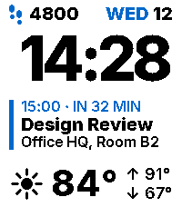
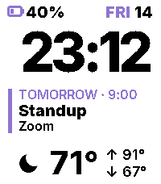
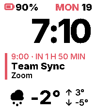
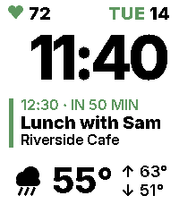
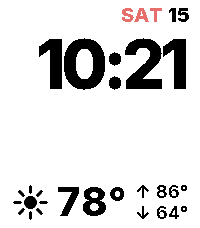

# Almanac

  <!-- workday · accent: GColorBlue · time: 14:28 (868) · WED 12 · today 20260812 · clear 84° hi91 lo67 · sun 381–1234 · event today 900 "Design Review" @ "Office HQ, Room B2" · topleft: steps 4800 -->
  &nbsp;&nbsp;&nbsp;&nbsp;
  <!-- night · accent: GColorVividViolet · time: 23:12 (1392) · FRI 14 · today 20260814 · clear (moon) 71° hi91 lo67 · sun 381–1234 · event tomorrow 540 "Standup" @ "Zoom" · topleft: battery 40 -->
  &nbsp;&nbsp;&nbsp;&nbsp;
  <!-- snow · accent: GColorRed · time: 7:10 (430) · MON 19 · today 20260119 · snow -2° hi3 lo-5 · sun 490–1010 · event today 540 "Team Sync" @ "Zoom" · topleft: battery 90 -->
  &nbsp;&nbsp;&nbsp;&nbsp;
  <!-- rain · accent: GColorIslamicGreen · time: 11:40 (700) · TUE 14 · today 20260414 · rain 55° hi63 lo51 · sun 400–1180 · event today 750 "Lunch with Sam" @ "Riverside Cafe" · topleft: heart 72 -->
  &nbsp;&nbsp;&nbsp;&nbsp;
  <!-- free · accent: GColorOrange · time: 10:21 (621) · SAT 15 · today 20260815 · clear 78° hi86 lo64 · sun 381–1234 · no event · topleft: none -->
  

A calm Pebble watchface built around the two things you actually look down for: **what's
coming up** and **what the sky is doing**. Three blocks stacked on a plain field, nothing else.

- **Date** — weekday and day number, top right.
- **Time** — big and unmissable.
- **Next event** — your calendar's next appointment (today, or tomorrow's first) with a live
  countdown, title, and location, marked by a colored accent bar. Empty space when you're free.
- **Weather** — a condition icon, the current temperature, and today's high and low.
- **Optional instrument** — step count, heart rate, or battery in the top-left corner. Off by
  default.

## Setup

Configure in the Pebble app settings:

- **Accent color** — used for the event block.
- **Background and text color** — the whole face is themable; defaults to black type on white.
- **Temperature unit** — °F or °C.
- **Top left display** — nothing, steps, heart rate, or battery.
- **Language** — English, German, French, Spanish, Italian, Portuguese, or Dutch. Sets the
  weekday abbreviation and the countdown wording.
- **ICS feed URL** — paste your calendar's private ICS address to enable the event block
  (Google Calendar: Settings → your calendar → *Secret address in iCal format*). Supports
  daily and weekly recurring events. Leave empty to keep the center clear.

Weather comes from [Open-Meteo](https://open-meteo.com/) using the phone's location and
refreshes every 30 minutes.

## Credits

Almanac began as a fork of [Percival](https://github.com/barefootford/Percival) by Andrew Ford,
and was redesigned around the time, next-event, and weather blocks. MIT licensed, like the
original.
