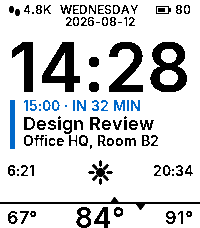
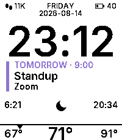
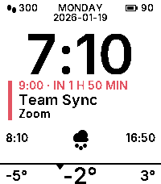
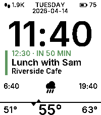
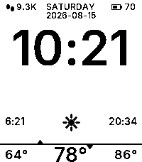

# Percival

  <!-- workday · accent: GColorBlue · time: 14:28 · WEDNESDAY 2026-08-12 · steps: 4800 · batt: 80 · clear 84° hi91 lo67 · sun 6:21–20:34 · event today 15:00 "Design Review" @ "Office HQ, Room B2" -->
  &nbsp;&nbsp;&nbsp;&nbsp;
  <!-- night · accent: GColorVividViolet · time: 23:12 · FRIDAY 2026-08-14 · steps: 11200 · batt: 40 · clear (moon) 71° hi91 lo67 · sun 6:21–20:34 · event tomorrow 9:00 "Standup" @ "Zoom" -->
  &nbsp;&nbsp;&nbsp;&nbsp;
  <!-- snow · accent: GColorRed · time: 7:10 · MONDAY 2026-01-19 · steps: 300 · batt: 90 · snow -2° hi3 lo-5 · sun 8:10–16:50 · event today 9:00 "Team Sync" @ "Zoom" -->
  &nbsp;&nbsp;&nbsp;&nbsp;
  <!-- rain · accent: GColorIslamicGreen · time: 11:40 · TUESDAY 2026-04-14 · steps: 1900 · batt: 75 · rain 55° hi63 lo51 · sun 6:40–19:40 · event today 12:30 "Lunch with Sam" @ "Riverside Cafe" -->
  &nbsp;&nbsp;&nbsp;&nbsp;
  <!-- free · accent: GColorOrange · time: 10:21 · SATURDAY 2026-08-15 · steps: 9300 · batt: 70 · clear 78° hi86 lo64 · sun 6:21–20:34 · no event -->
  

A calm, opinionated Pebble watchface: black type on white, everything temporal on one
vertical centerline.

- **Status bar** — step count and battery in the corners, weekday and ISO date centered.
- **Time** — big and unmissable.
- **Next event** — your calendar's next appointment (today, or tomorrow's first) with a live
  countdown, title, and location, marked by a colored accent bar. Empty space when you're free.
- **Weather instrument** — sunrise and sunset frame a horizon line; a triangle above it tracks
  the sun's progress through the day (hidden at night), a triangle below tracks the current
  temperature between today's low and high. Condition icon switches to a moon on clear nights.

## Setup

Configure in the Pebble app settings:

- **Accent color** — used for the event block.
- **Temperature unit** — °F or °C.
- **ICS feed URL** — paste your calendar's private ICS address to enable the event block
  (Google Calendar: Settings → your calendar → *Secret address in iCal format*). Supports
  daily and weekly recurring events. Leave empty to keep the center clear.

Weather comes from [Open-Meteo](https://open-meteo.com/) using the phone's location and
refreshes every 30 minutes.
